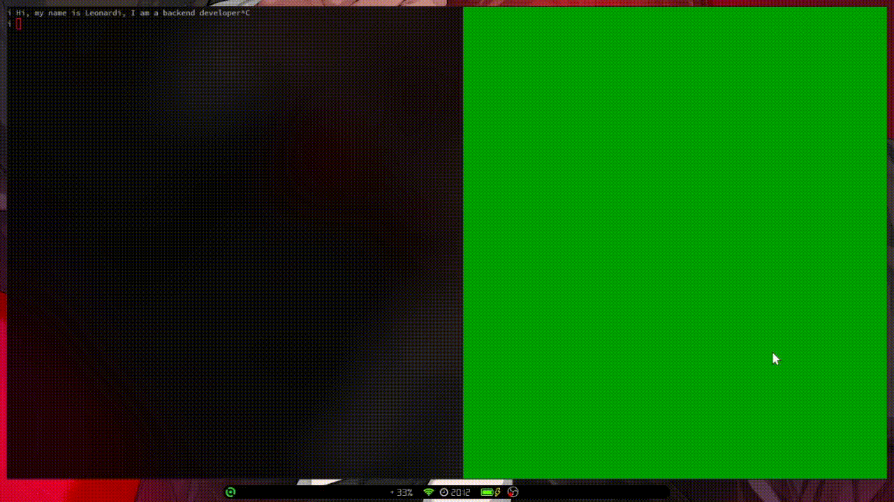
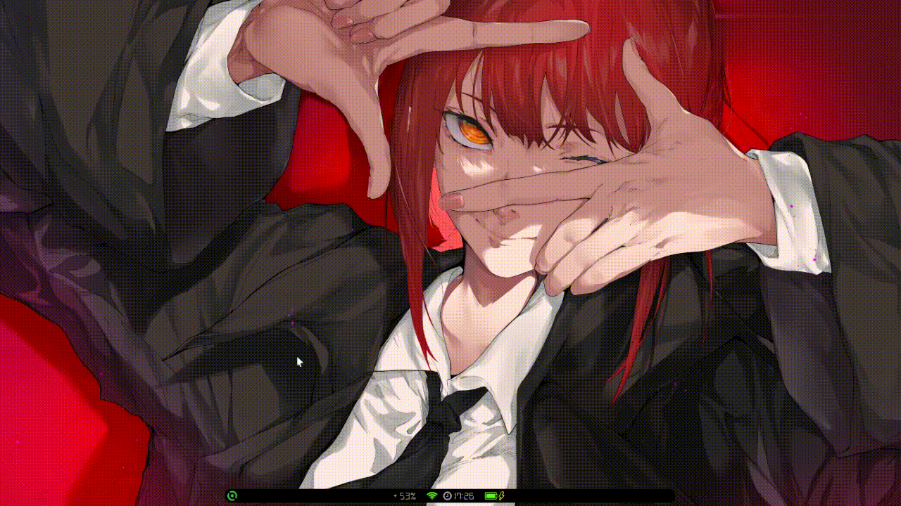

<!-- ABOUT THE PROJECT -->




### Getting Started
  ---
##### Clone repo
```sh
$ git clone https://github.com/darkstar-x/char-bubbles-ui.git
```
```sh
$ cd your_path/char-bubles-ui
```
##### Install dependency
```sh
$ npm install
```
```sh
$ yarn install
```
##### Run
```sh
$ npm run dev
```
